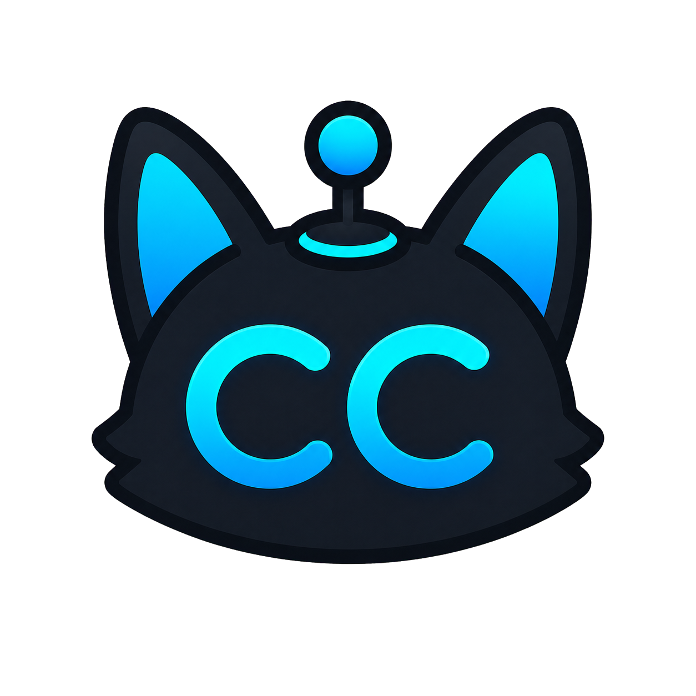
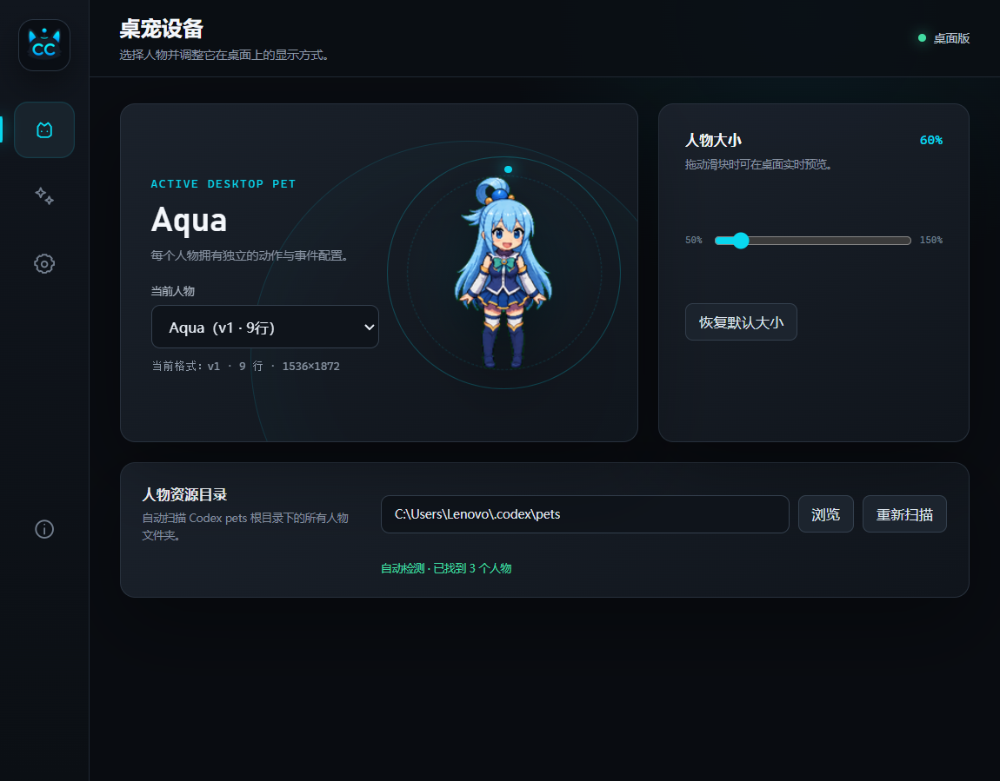
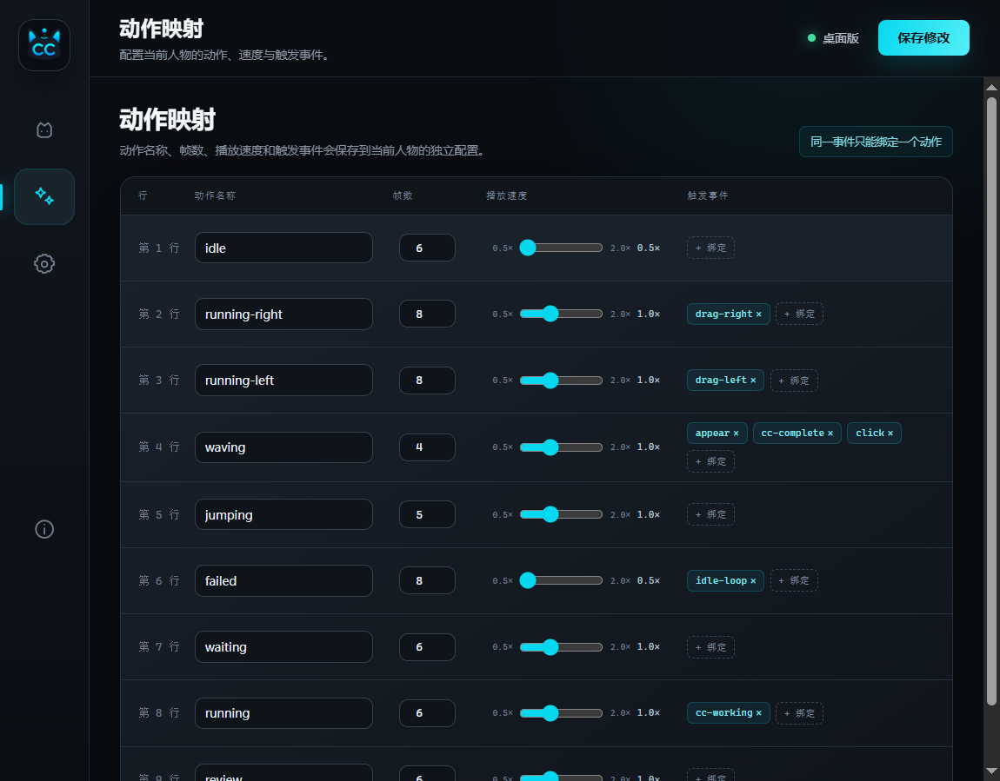
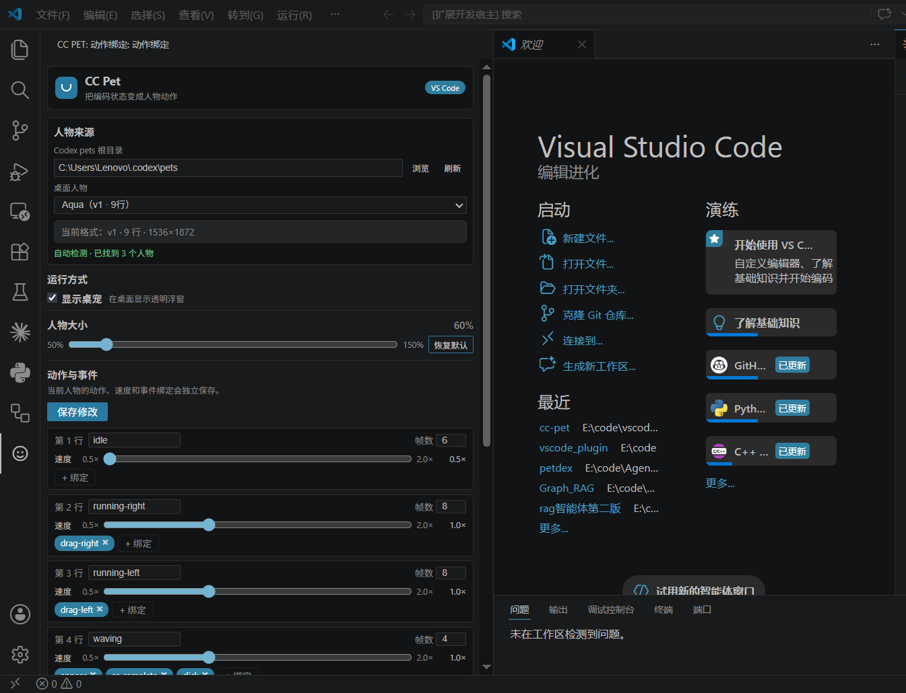

<p align="center">
  
</p>

<h1 align="center">CC Pet</h1>

<p align="center">
  <a href="README.md">English</a> | 简体中文
</p>

<p align="center">
  <strong>让 Claude Code 也拥有一只会回应工作状态的桌面宠物</strong>
</p>

<p align="center">
  随着 Codex 桌宠的兴起，越来越多开发者开始用动画角色陪伴编码，但 Claude Code 还缺少同样直观的桌宠体验。<br>
  CC Pet 因此而生：它能感知 Claude Code 的思考、执行、等待与完成状态，并通过人物动作和气泡实时反馈。
</p>

<p align="center">
  同时提供 <strong>Windows 独立桌面端</strong> 与 <strong>VS Code 插件</strong>，可直接复用 Codex / Petdex 宠物配置，<br>
  兼容新旧 9 行与 11 行精灵表，并允许用户完全自定义动作名称、帧数、速度和事件绑定。<br>
  所有配置都可以在桌面 GUI 中完成，不需要手动修改 JSON，新手也能轻松使用。
</p>

<p align="center">
  <a href="https://github.com/ChenDX404/CC-Pet/releases/latest"><strong>下载最新版本</strong></a>
  ·
  <a href="https://github.com/crafter-station/petdex">获取更多 Codex / Petdex 宠物</a>
</p>

<p align="center">
  透明置顶窗口 · 自由拖拽 · Claude Code 状态感知 · Codex 宠物兼容 · 可视化动作绑定
</p>

---

## 🎬 动画演示

### 与 Claude Code 实时互动

人物会根据 Claude Code 的工作状态切换动作，并在工作中与完成时显示对应气泡。

<p align="center">
  
</p>

### 桌面控制中心

通过可视化 GUI 切换宠物、调整人物大小，并配置每个动作的名称、帧数、速度和触发事件。

<p align="center">
  
</p>

## 🖼️ 界面预览



<table>
  <tr>
    <td></td>
    <td></td>
  </tr>
  <tr>
    <td align="center">桌面端动作映射</td>
    <td align="center">VS Code 插件设置</td>
  </tr>
</table>

---

## ⚠️ 首次使用必读

CC Pet 支持 Codex v1（9 行）和 v2（11 行）精灵表，并会根据图片尺寸自动识别版本。

首次使用自定义宠物时，请打开 GUI 设置页面，确认每一行的动作名称和实际帧数。宠物作者决定每行画了什么内容，CC Pet 的内置名称只是初始默认值，你可以自由修改。

**v2（11 行）默认动作说明：**

| 行号 | 约定用途 | 名称 |
|------|----------|------|
| 第 1 行 | 默认待机 pose | 🔧 可自定义 |
| 第 2 行 | 向右移动 | 🔧 可自定义 |
| 第 3 行 | 向左移动 | 🔧 可自定义 |
| 第 4 行 | 欢迎/挥手 | 🔧 可自定义 |
| 第 5 行 | 跳跃/请安 | 🔧 可自定义 |
| 第 6 行 | 失败/闭眼 | 🔧 可自定义 |
| 第 7 行 | 等待/摊手 | 🔧 可自定义 |
| 第 8 行 | 审阅/思考 | 🔧 可自定义 |
| 第 9 行 | 歪头/变体 | 🔧 可自定义 |
| 第 10 行 | 抬头/单击反馈 | 🔧 可自定义 |
| 第 11 行 | 转身/长空闲变体 | 🔧 可自定义 |

> 💡 行号和用途是约定俗成的（对标 Codex 精灵格式），但**每行的显示名称由你在 GUI 中自由填写**。

**你需要做的：** 打开 GUI 设置页面，对每行动作：
1. ✏️ **起个名字** — 方便你在事件绑定时识别
2. 📐 **填入帧数** — 这行在精灵表里实际有几帧

**怎么知道每行几帧？** 把精灵表想象成小人书——每行从左到右翻，每翻一页就是一个人物 pose。翻到空白页了，前面的页数就是这行的帧数。设置页面有逐帧预览，点几下就能数出来。

### 🔧 GUI 设置页面能做什么？

| 功能 | 说明 |
|------|------|
| ✏️ **动作名称** | 每行都可自定义显示名称（中文/英文/Emoji 都行） |
| 📐 **帧数设置** | 逐行指定实际帧数（1-8） |
| ⚡ **播放速度** | 逐行调整动画快慢（0.5x ~ 2.0x） |
| 🔗 **事件绑定** | 自由映射事件 → 动作名（拖动、点击、悬浮、CC 状态等） |
| 🐱 **宠物切换** | 扫描本地目录，选择当前宠物 |
| 🔍 **大小预览** | 实时拖动滑块调整显示比例 |

> 💡 以上全部通过 GUI 操作，无需手动编辑 JSON。人物大小支持实时预览；动作名称、帧数、速度和事件绑定需要点击“保存修改”后生效。

---

## 📦 安装

### 方式一：VS Code 插件

从 [GitHub Releases](https://github.com/ChenDX404/CC-Pet/releases/latest) 下载 `cc-pet-win32-x64.vsix`：

```
Ctrl+Shift+P → Extensions: Install from VSIX... → 选择 .vsix 文件
```

安装后 VS Code 活动栏出现 🐾 **「CC Pet: 动作绑定」** 图标，点击即可打开设置页面。

### 方式二：Windows 桌面版（无需 VS Code）

从 [GitHub Releases](https://github.com/ChenDX404/CC-Pet/releases/latest) 下载：

| 文件 | 说明 |
|------|------|
| `CC-Pet_x.x.x_windows-x64-setup.exe` | 📦 NSIS 安装程序，装完即用 |
| `CC-Pet_x.x.x_windows-x64-portable.exe` | 🚀 便携免安装版，双击运行 |

桌面版运行后**系统托盘**右键 → 打开控制中心进行设置。

> 当前首个公开版本仅支持 Windows x64。安装版检测到缺少 WebView2 时，会联网下载并自动安装；便携版不会自动安装 WebView2，需要系统中已存在 WebView2 Runtime。

---

## ✨ 功能

| 分类 | 功能 |
|------|------|
| 🪟 **桌面浮窗** | 透明背景、始终置顶、无边框、可拖拽 |
| 🤖 **CC 状态感知** | 自动检测空闲 / 思考中 / 等待输入 / 执行命令 / 完成 / 出错 |
| 💬 **智能气泡** | 工作态显示用户问题摘要 + 旋转提示条；完成态显示最终回复气泡 |
| 🎞️ **精灵动画** | 支持 9 行和 11 行动作，每行独立配置帧数和播放速度 |
| 🎛️ **GUI 设置** | VS Code 侧边栏 / 桌面独立窗口，事件绑定、动作名称全部可视化编辑 |
| 📂 **自动发现** | 扫描 `~/.codex/pets`，兼容 9 行(v1) 和 11 行(v2) Codex 精灵格式 |
| 👥 **多宠物** | 每只宠物独立配置，一键切换 |
| 🖥️ **双模运行** | VS Code 插件模式 或 桌面独立模式，共享同一份配置 |

---

## 🏗️ 两种使用方式

| 方式 | 适合谁 | CC 状态检测 |
|------|--------|-------------|
| **VS Code 插件** | 主要在 VS Code 内使用 Claude Code | 插件通过 WebSocket 推送状态到桌面浮窗 |
| **Windows 桌面版** | 希望桌宠独立运行 | 内置 Rust 状态检测器，不依赖 VS Code |

> 📁 两种方式共享 `%APPDATA%\CC Pet\` 下的配置，切换使用无需重新设置。

---

## 🎨 宠物格式

CC Pet 兼容 Codex 桌面精灵标准，可从 [Petdex GitHub 仓库](https://github.com/crafter-station/petdex) 直接安装：

```bash
npx petdex install boba    # 安装到 ~/.codex/pets/boba/
# CC Pet 自动发现，在 GUI 里选择即可
```

```
my-pet/
├── pet.json            # 元数据：名称、精灵图路径
└── spritesheet.webp    # 精灵表（支持 WebP / PNG）
```

**精灵表规格：**

| 参数 | v1（9 行） | v2（11 行） |
|------|-----------|-------------|
| 尺寸 | 1536 × 1872 | 1536 × 2288 |
| 每格 | 192 × 208 | 192 × 208 |
| 网格 | 8 列 × 9 行 | 8 列 × 11 行 |

CC Pet 自动识别版本并适配。

---

## 📁 配置

### 用户配置位置

```
%APPDATA%\CC Pet\
├── config.json              # 全局设置（选中的宠物、缩放、桌面开关等）
└── profiles\
    ├── xiuxiu.json          # 每只宠物独立的帧数/速度/名称/绑定
    └── boba.json
```

### VS Code 插件设置

| 设置项 | 默认值 | 说明 |
|--------|--------|------|
| `ccPet.petsRootDirectory` | 空（自动使用 `~/.codex/pets`） | 宠物根目录 |
| `ccPet.autoLaunchDesktop` | `true` | 启动 VS Code 时自动打开桌面浮窗 |

---

## 🔒 隐私说明

CC Pet 只在本机读取 Claude Code 的 `~/.claude/sessions` 会话索引和 `~/.claude/projects` transcript JSONL，用于判断工作状态、提取当前问题摘要和最终回复。运行时不会额外调用大模型，也不会主动上传会话内容。

---

## 📂 项目结构

```
cc-pet/
│
├── src/                        # 📦 VS Code 插件源码 (TypeScript)
│   ├── extension.ts            #   扩展入口：启动 IPC、拉起桌宠、注册侧边栏
│   ├── ccStatusDetector.ts     #   CC 状态检测（监控 session JSONL）
│   ├── petIPC.ts               #   WebSocket 服务端 (端口 19420-19429)
│   ├── petCatalog.ts           #   宠物目录扫描（v1/v2 自动识别）
│   ├── petProfiles.ts          #   每只宠物的行/绑定配置管理
│   ├── userConfig.ts           #   用户配置读写 (%APPDATA%\CC Pet\)
│   ├── petBindingView.ts       #   侧边栏绑定编辑器 (WebviewView)
│   ├── pet-renderer/           #   共享渲染核心（11 行约定表）
│   └── test/                   #   全部测试 (Mocha)
│
├── src-tauri/                  # 🦀 Tauri 桌面应用 (Rust)
│   ├── src/main.rs             #   入口：窗口、托盘、生命周期
│   ├── src/commands.rs         #   Tauri 命令（bootstrap/save/scale/select）
│   ├── src/config.rs           #   配置管理（线程安全，原子写入）
│   ├── src/catalog.rs          #   宠物目录扫描（镜像 TS 版）
│   ├── src/profiles.rs         #   Profile 管理（镜像 TS 版）
│   ├── src/status.rs           #   独立 CC 状态检测器
│   ├── Cargo.toml              #   Rust 依赖
│   └── tauri.conf.json         #   窗口配置 + NSIS 打包
│
├── dist-pet/                   # 🌐 桌面浮窗 Webview 前端 (纯 JS)
│   ├── index.html              #   入口 HTML
│   ├── pet.js                  #   核心渲染引擎（精灵帧、动画循环、拖拽）
│   ├── pet-ipc.js              #   IPC 客户端（连接 VS Code WebSocket）
│   ├── pet-binding.js          #   绑定编辑器 UI（共享）
│   ├── settings-host.js        #   acquireVsCodeApi 的 Tauri polyfill
│   └── settings.html           #   桌面设置窗口
│
├── media/                      # 🎨 共享 UI 资源（源文件）
│   ├── pet-binding-vscode.html #   VS Code 侧边栏 HTML 模板
│   ├── pet-binding-desktop.html#   桌面版设置 HTML 模板
│   ├── pet-binding.js/css      #   绑定编辑器 JS/CSS
│   └── pet-bubble.css          #   气泡样式
│
├── scripts/                    # 🔧 构建脚本
│   ├── sync-desktop-assets.mjs #   同步 media/ → dist-pet/
│   └── stage-vscode-binary.mjs #   复制 exe 到 bin/
│
├── bin/                        # 构建产物（仅本地，不入 git）
├── releases/                   # 构建产物（仅本地，不入 git）
└── pet-config.json             # 默认配置（首次启动用）
```

### 镜像实现（TS ↔ Rust）

| 功能 | TypeScript | Rust | 关系 |
|------|-----------|------|------|
| 📂 宠物目录扫描 | `src/petCatalog.ts` | `src-tauri/src/catalog.rs` | 镜像 |
| ⚙️ 宠物配置管理 | `src/petProfiles.ts` | `src-tauri/src/profiles.rs` | 镜像 |
| 🤖 CC 状态检测 | `src/ccStatusDetector.ts` | `src-tauri/src/status.rs` | 互补 |
| 💾 配置持久化 | `src/userConfig.ts` | `src-tauri/src/config.rs` | 镜像 |

### 数据流

```
安装宠物                     CC 状态检测
    │                             │
npx petdex install boba      监控 ~/.claude/sessions/
    ↓                             ↓
~/.codex/pets/boba/         src/ccStatusDetector.ts
    ↓                             │
src/petCatalog.ts 扫描            │ WebSocket (127.0.0.1:19420-19429)
    │                             ↓
    │                     dist-pet/pet-ipc.js → pet.js
    │                             │
    └─────────────────────────────┘
              🖥️ 桌面浮窗渲染
```

---

## 🛠️ 本地开发

### 环境要求

- Node.js ≥ 18
- Rust (msvc toolchain)
- VS Code

```bash
git clone https://github.com/ChenDX404/CC-Pet.git
cd cc-pet
npm install
npm test                    # 编译 + lint + 测试
npm run desktop:prepare     # 准备桌面端前端资源
```

### VS Code 插件调试

按 `F5` 启动 Extension Development Host。

### 桌面端检查

需先安装 [Rust](https://rustup.rs)（Windows 选 msvc toolchain）。

```bash
cd src-tauri
cargo check
```

---

## 🔨 构建

```bash
# Windows NSIS 安装包
npm run desktop:build       # → src-tauri/target/release/bundle/nsis/

# VS Code 插件包（需先构建 desktop:build）
npm run extension:package   # → releases/cc-pet-win32-x64.vsix
```

---

## 🧰 技术栈

| 层 | 技术 |
|----|------|
| VS Code 插件 | TypeScript · VS Code Extension API |
| 桌面壳 | Tauri 2 (Rust) · WebView2 |
| 桌面渲染 | 纯 JavaScript (无框架) · CSS Sprite |
| 通信 | 自研 WebSocket (RFC 6455) · 零依赖 |
| 打包 | NSIS (桌面) · vsce (插件) |

---

## 📝 License

MIT
